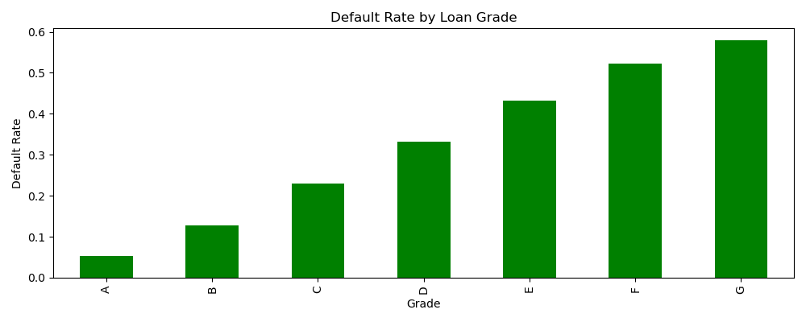
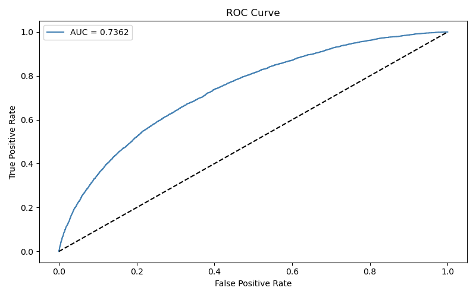
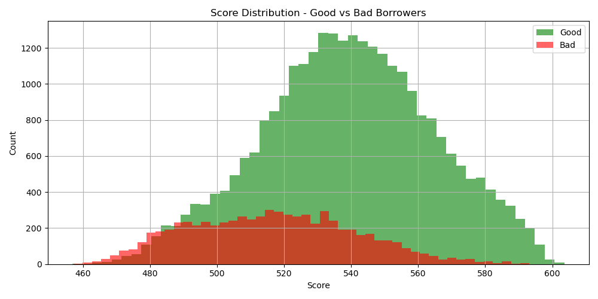
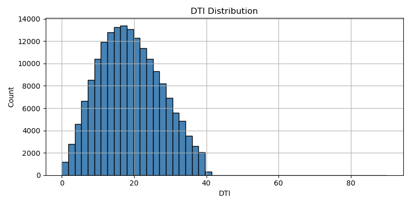

# Credit Risk Scorecard

  

## Overview
An end-to-end credit risk scorecard built on 176,075 LendingClub loans.
Predicts probability of default and assigns a credit score (300–850) to each borrower — mirroring real-world bank scorecards.

---

## Business Problem
Banks need to objectively assess loan applicants and minimize credit losses. This scorecard automates the approval decision using borrower data — replacing gut instinct with a statistically validated model compliant with Basel III principles.

---

## Methodology

```
Raw Data (176,075 loans)
       ↓
Exploratory Data Analysis (EDA)
       ↓
WoE / IV Feature Selection (12 variables selected from 151)
       ↓
Logistic Regression Model
       ↓
Scorecard Scaling (300–850)
       ↓
Validation (Gini, KS, AUC)
```

---

## Model Performance

| Metric | Score | Benchmark | Status |
|--------|-------|-----------|--------|
| Gini   | 0.47  | 0.45–0.75 | ✓ Pass |
| KS     | 0.34  | > 0.30    | ✓ Pass |
| AUC    | 0.74  | > 0.70    | ✓ Pass |

---

## Key Risk Drivers

| Feature | IV Score | Risk Direction |
|---------|----------|----------------|
| Sub Grade | 0.65 | Higher grade = lower risk |
| Interest Rate | 0.64 | Higher rate = higher risk |
| Loan Term | 0.32 | 60 months riskier than 36 |
| DTI | 0.09 | Higher DTI = higher risk |
| Verification Status | 0.06 | Unverified = higher risk |

---

## Visualizations

### Default Rate by Loan Grade


### ROC Curve


### Score Distribution — Good vs Bad Borrowers


### DTI Distribution


---

## Score Cutoff Recommendation

| Score Band | Decision | Risk Level |
|------------|----------|------------|
| Above 560  | Approve  | Low        |
| 530 – 560  | Review   | Medium     |
| Below 530  | Reject   | High       |

---

## Business Recommendation
Reject all applications scoring below 530. This threshold captures the majority of bad borrowers while approving most good borrowers. At a default rate of 19.93%, this cutoff significantly reduces expected credit losses.

---

## Limitations
- Model trained on US data — recalibration needed for GCC deployment
- Economic cycle not accounted for — stress testing recommended
- Requires annual redevelopment as borrower behavior shifts

---

## Project Structure

```
credit-risk-scorecard/
├── notebooks/
│   └── 01_credit_scorecard.ipynb   ← Full analysis
├── outputs/
│   ├── default_rate_by_grade.png
│   ├── default_rate_by_term.png
│   ├── dti_distribution.png
│   ├── roc_curve.png
│   ├── score_distribution.png
│   └── scorecard_summary.csv
├── risk_committee_summary.md        ← Business summary
└── README.md
```

---

## Dataset
LendingClub Loan Data (2007–2018) — Available on Kaggle

## Tools
Python, Pandas, NumPy, Scikit-learn, Matplotlib, Seaborn, Pickle
